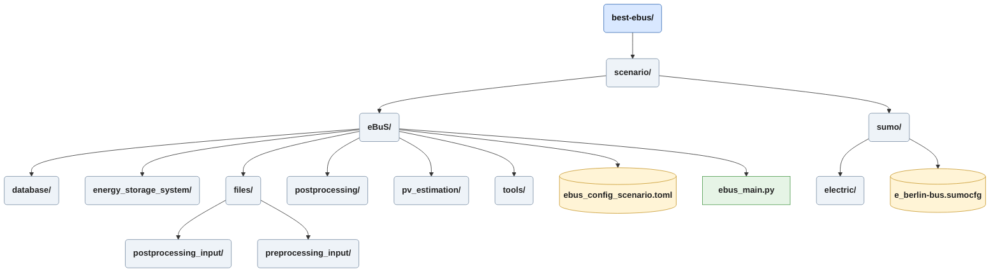

# ReadMe for the eBuS extension to the BeST-Scenario

The **electric Bus utilization Scenario (eBuS)** is a fork of the **[Berlin Sumo Traffic (BeST) Scenario.](https://github.com/mosaic-addons/best-scenario)**
It is being developed as part of a masters-thesis at the FU-Berlin in 2026 with the goal of extending the capabilitys of **BeST** to simulate electric buses and their charging stations to generate data on charging behaviour and energy requierments.
Additionaly skripts for extending charging stations into integrated energy hubs, using energy storage systems and photovoltaic power generation, are planned.

The simulation is intended to be able to handle multiple depots, service lines, charging stations and bus models.

To limit the scope during the development and the proof-of-concept phase, the implementation focuses on two depots, each designed for 200+ buses, servicing nearly 50 lines and implementing 94 charging Stations.

This ReadMe is currently being updated.

Dependencys:
* [Eclipse Sumo (Version 1.27.0)](https://github.com/eclipse-sumo/sumo/tree/main/docs)
* An electric Vehicle Scheduling Problem (eVSP) solving methode for a baseline solution
* Online connectivity for [PVGIS-API](https://joint-research-centre.ec.europa.eu/photovoltaic-geographical-information-system-pvgis_en) calls

## Instructions
The **eBuS** directory contains most of the files and skripts needed to prepare and start a complete run of the **BeST-eBuS(cenario)**. An overview of the **eBuS** subdirectorys is provided in the *structur* sections.

Also refer to the documentation under *./docs/ebus/*.

### Structure of the Repository

#### Heuristic Preprocessing

Skripts in *preprocessing* are used to create textfiles used as input for a solving heuristic.
Available lines are taken from *berlin_bus.rou.xml*, where there is a *to* and *from* for each.
For eBuS the type and line data has been taken from the website [berliner-lininchronik.de](https://www.berliner-linienchronik.de/fahrzeuge-bvg.html) (Sawall, Fabian; 2026) \
While manual definition of routes is possible, and adjustments can be made to fine-tune simulation behaviour, the assignment of vehciles to services is computed by a heuristic solving method (Janus, Robert; n.y.)

1. *heuristic_preprocessing.py* is a wrapper for all other skripts in the *preprocessing* directory, performing the functions calls in order.
2. Begining with *filter_lines.py* where first every route and flow not found in the *[heuristic_preprocessing.lines]* table of *ebus_config.toml* is removed from *berlin_bus.rou.xml*.
    While **BeST** operates on the **SUMO** flow-functionality, which generates and destroys vehicles for a given route periodically, **eBuS** requieres the use of persistent vehicles. Therefore different parameters are calculated from the combined routes and flows of each line. 
    This operation creates a *to* and *from* for each route, and calculates the number of requiered repetitions and period intevals from the corresponding flows. The result is a *merged_routes.csv* which in turn can be used to create trip defintions for each depot.
3. As there was an issue, with routes continuing beyond their last passenger stations, presumably to travel to operational stations, *cut_lines.py* removes these sections of routes. While it would be more accurate to also model operation stations as charging-points, this simplification was made for time expenditure reasons.
4. The calculation of deadheads, e.g. trips without passengers between service stations, is requiered to build the complete tour of a single vehicle. The skript produces not only information on the travel time between every stop of the network, but also creates a reference *.rou.xml* from which all later routes are constructed. Deadhead timings are also exportet as *.txt* to be used as solver input.

#### Heuristic Postprocessing

1. Assumes a solver output with a specific format. \
    One *solution.json* for each depot. This includes all vehicles and the trips they perform, aswell as designated charging stations and times.
2. Designated charging station ids are read from the solution, corresponding busStops are read from *berlin_bus_stops.add.xml* and modfied into charging stations at the same position. Chargers at the depots are added. Here modifcations to charging station parameters can be made. For future functionality geo coordinates are calculated and saved.
3. The building of the final routes concatenates the building blocks from the reference route file accoarding to the solution. To handle differing departure times, vehicles and routes are split into two *e_vehicles.rou.xml* and *e_routes.rou.xml. This way timing values in the later are automatically relative to the departure time of the vehicles.

#### External Calls
1. *pvgis_api_v6*.py is used for photovoltaic power generation for charging stations, the data is requested from PVGIS via API calls and saved to various files.

## eBuS Directory Structure
           
### SUMO & electric Files

#### Depots and Vehicle Types

*e_depots.add.xml* and *e_type.add.xml*.
These short files are manually created, and define both depots, as well as available vehicle types to perform the routes. Currently three bus types are defined.

##### Limitations
Due to long vehicles blocking the comparatively short bus stops for long durations, bus length has been set to one meter. 
This is a workaround for not modeling the real service stations at multiple locations. If that is done, the *cut_lines* skript will be obsolete, and the route generation will need to be adjusted.
**eBuS** currently does not provide the heuristic solver that has been used. 
Users are requiered to either use the solutions provided within the repository, use their own solver, or adjust the given solution as needed.

#### Sumo Config File

**eBuS** comes with its own **SUMO** configuration file, *e_berlin.sumocfg*. This config loads all previously created *e_* files and sets the simulation parameters. Additional output requierments are set, creating logs for charging and battery output.

## SUMO Directory Structure

## ToDos
* Integrate applicable Data (PV-Estimation, Multiple SolutionFiles, etc.)
* Allow for ESS-execution on existing outputs, creating new scenarios.
* Only run preprocessing once per main call.
* Analysis Notebooks and Directory will be removed from Repository in a future update.
* Need to switch away from mermaid diagramms again.

## Modifications to files provided by BeST
Minor adjustments have been made to *berlin.net.xml*, to include two bus depots, one at **Cicerostraße** in Charlottenburg-Wilmersdorf, and the other at **Müllerstraße**, Wedding. Within the code these are named cicerostrasse and muellerstrasse respectively.
Additionaly whenever changes to intersections or lanes where made, these had to be mirrored by adapting the *berlin_bus.rou.xml* accordingly.

## Information & Contact
**Author:** Sven Vorgheim \
**License:** \
**Maintainer:** Sven Vorgheim \
**Email:** sven.vorgheim@fu-berlin.de \
**Project status:** Prototype v1.0\
**Last updated:** 22.07.2026

### Disclaimer 
Generative AI was used in the creation process for some skripts.