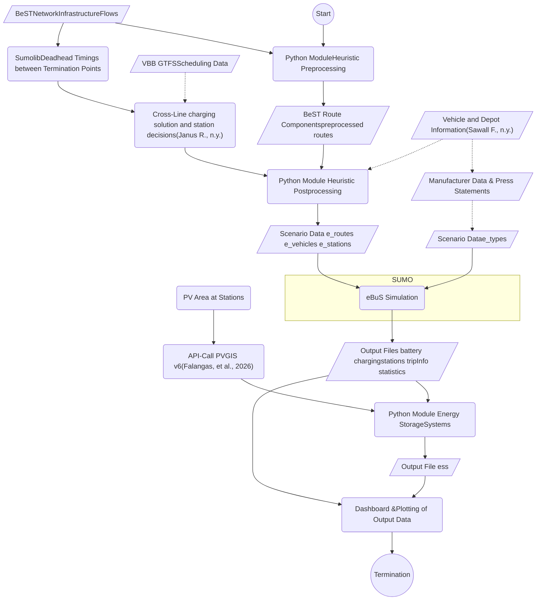

# BeST-eBuS

## Introduction
The **electric Bus utilization Scenario (eBuS)** is a fork of the **[Berlin Sumo Traffic (BeST) Scenario.](https://github.com/mosaic-addons/best-scenario)**
It is being developed as part of a masters-thesis at the FU-Berlin in 2026 with the goal of extending the capabilitys of **BeST** to simulate electric buses and their charging stations to generate data on charging behaviour and energy requierments.
Additionaly skripts for extending charging stations into integrated energy hubs, using energy storage systems and photovoltaic power generation, are planned.

The simulation is intended to be able to handle multiple depots, service lines, charging stations and bus models.

To limit the scope during the development and the proof-of-concept phase, the implementation focuses on two depots, each designed for 200+ buses, servicing nearly 50 lines and implementing 94 charging Stations.

Dependencys:
* [Eclipse Sumo (Version 1.27.0)](https://github.com/eclipse-sumo/sumo/tree/main/docs)
* An electric Vehicle Scheduling Problem (eVSP) solving methode for a baseline solution
* Online connectivity for [PVGIS-API](https://joint-research-centre.ec.europa.eu/photovoltaic-geographical-information-system-pvgis_en) calls

## Codebase
The code base is seperated accoarding to function and progression of simulation preperation.
The structure of the repository has been left largely unchanged as it was provided by BeST.
Therefore by default there are two directorys immediatly visible, which are the docs and scenario directory.

### Docs
Within the docs reside a directory for files inheritet from BeST and a directory for eBus, where this documentation file can be found.
Furthermore within the *docs/ebus/schemata* subdirectory related drawio and mermaid diagramms are located.

### Scenario
The scenario directory holds [(almost)](#additional-files) all the requiered files for configuring and performing the simulation. Many of the contents are again inherited from BeST and will not be discussed in this document.
The three most relevant directorys therefore are eBuS sumo and output, whose purpose and function will be discussed in the following. For visual overview refer to the [Diagramm](#diagramm-of-python-files) below.

#### Scenario/eBuS
The majority of content belonging to eBuS lies within the subdirectory *scenario/eBuS*. 
It is here that a scenario is configured, a scenario configuration is defined in a *.toml* file, which should follow the naming scheme:
*ebus_config_[scenario-name].toml*. Scenarios may differ i a number of ways. The structure of the configuration file mostly follows the underlying structure of the programm. The configuration options wihin will be explained in their respective section.

Furthermore the unified entry point *ebus_main.py*, which uses configuration files for running the simulation is within this directory.
Within the main a list of scenario configuration files can be given, which will be executed in series when calling the main.

The follwing diagramm shows a highlevel view of the execution process.

### Additional Files

#### Notes and Extras

* The directory *scenario/eBuS* should be refactored to *scenario/ebus* for ease of use, Linux <-> Windows compatibilty and simply for convention.
* Main should take a list of configurations as an argument.