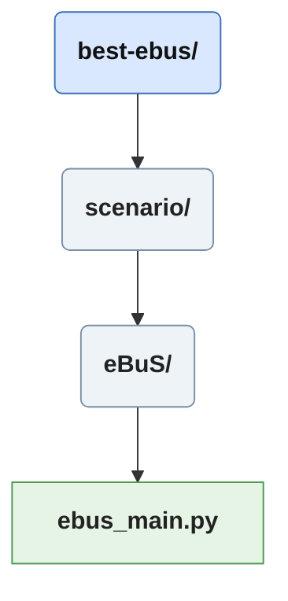
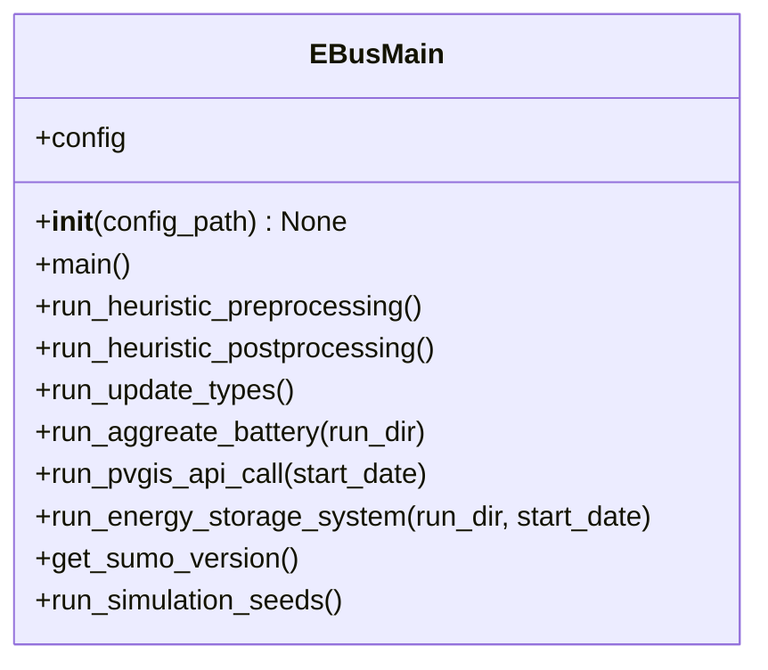

# Scenario/ebus main

The *ebus_main.py* fulfills multiple purposes, first defining the list of scenarios to be run, reading and applying the configuration parameters, orchestrating the execution, and managing the storage of the output files.
Core part of this module is the [run simulation](#run-simulation-seeds) function.

## Run Heuristic Preprocessing
Sets the paths and variables required by [heuristic preprocessing](./preprocessing_doc.md).
Is executed before each scenario, not strictly necessary if the infrastructure remained unchanged.

## Run Heuristic Postprocessing
Sets the paths and variables required by [heuristic postprocessing](./postprocessing_doc.md).
Is executed before each scenario, this is mandatory to have changes to configuration reflected within the simulation.

## Run Update Types
The function is run before each scenario to edit the [vehicle type](./electric_doc.md) file for changing constant power intake.

## Run Aggregate Battery
Executes the [battery aggregation tool](./tools_doc.md), the original battery file is removed after.

## Run PVGIS Api Call
Executes the [PVGIS Api Call](./pv_estimation_doc.md) for all stations in the *e_stations.add.xml* file for each run.

## Run Energy Storage System
Executes the [Energy Storage System](./ess_doc.md) for each seed in a run.

## Get Sumo Version
Simple print of currently active SUMO version.

## Run Simulation Seeds
Execute the SUMO simulation multiple times with different seeds using SUMO's runSeeds.py tool (SUMO_HOME/tools/runSeeds.py). While the seed is incorporated into the runs directory names, there seems to be no option for transferring the scenario name directly to the directory.

Next Chapter [Scenario/ebus_main](./ebus_main_doc.md).
