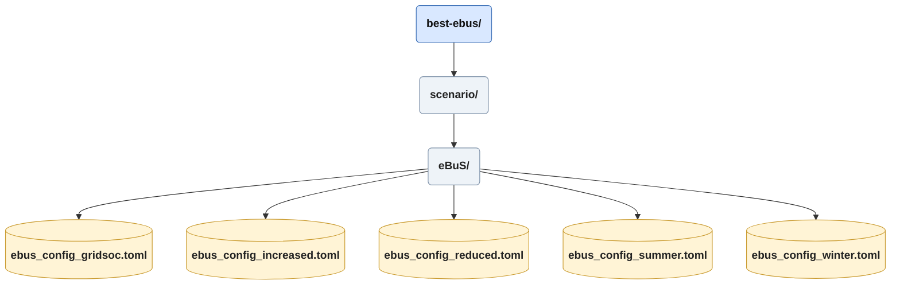

# Scenario / eBuS Config

These config files are what defines a scenario for the use with eBuS, the use the .toml format to separate the options by the section of the simulation they influence.

## Main
This section is currently empty

## Heuristic Preprocessing
### Depots
*depots* is a list of named depots intended to be used within the simulation.
New depots need to be created in netedit, and must receive a valid bus stop named "bs_{Name of Depot}", see the SUMO Docs on [bus stops](https://sumo.dlr.de/docs/Simulation/Public_Transport.html#bus_stops).

### Lines
This section contains the names, departure depots and bus type of the lines desired to be present within the simulation. Lines must be fully supported by underlying data. The options for supported types are: **EN** for regular buses, **GN** for articulated buses, and **DL** for double-decker buses, the last currently fall back to **GN**, as no double-decker model is implemented.
Structure: "Line" = ["Depot", "Type"]

## Heuristic Postprocessing

| Key | Description|
---|---|
|SOC-Percentage|This value determines the battery state of charge with which a bus is inserted into the simulation.|
|Chargingstation Power|This is the power in Watts that a station can provide to a charging bus.|
|Total Power Factor| Factor for total power available at all charging stations. Determines how fast multiple buses charge.|
|Allow Depot Charging| Whether the depot charging stations are allowed to charge buses. Set to false to simulate depots without charging capability.|
|Depot Total Power Factor| Factor for total power available at depot charging stations. Determines how many buses may charge at a depot simultaneously.|

## Aggregate Battery
### Interval
The *interval* is the only entry within this section, it determines the aggregation of the original battery file. This value should not be changed unless impacts upon the ess are understood and managed.

## Energy Storage System
| Key | Description|
---|---|
|ESS Factor|Determines Each station's energy capacity as the station's Peak Power in W times the factor for Wh.|
|Start SoC| Determines the state of charge of every charging stations at the beginning of the simulation|
|PV Factor| Scales the PV power generated by each station for ess calculations.|
|Grid Charge Max SoC| State of charge below which the station draws power from the grid to the storage automatically.|
|Grid Charge Power|Power in kW at which the storage is charged.|
|Efficiency|Determines energy losses between grid and storage float between zero and one.|
Note: PV Area and lines should be moved into a scenario overarching config file, with the option to overwrite if needed.

## vehicles
The only value here is *constant_power_intake*. This sets the constant power intake for all vehicle types to the configured value in watts.

## Run Simulation Seeds
### Seeds
The seeds value is a string of space separated integers which are used to determine the randomization of each instance, see [Sumo Documentation](https://sumo.dlr.de/docs/Tools/Misc.html#runseedspy).
### Threads
This is the number of parallel instances being executed as an integer. This value is limited by the physical properties (CPU threads) of the hardware.