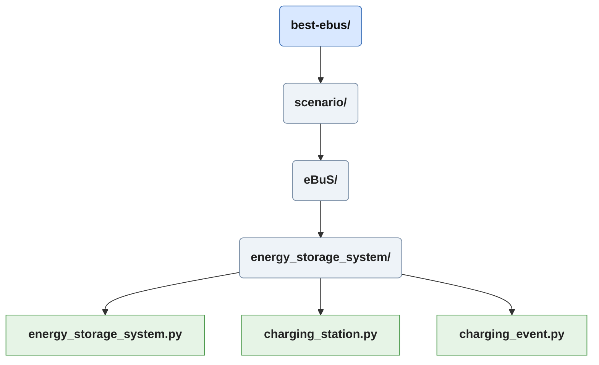
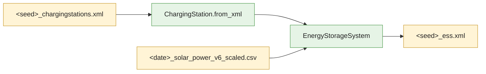
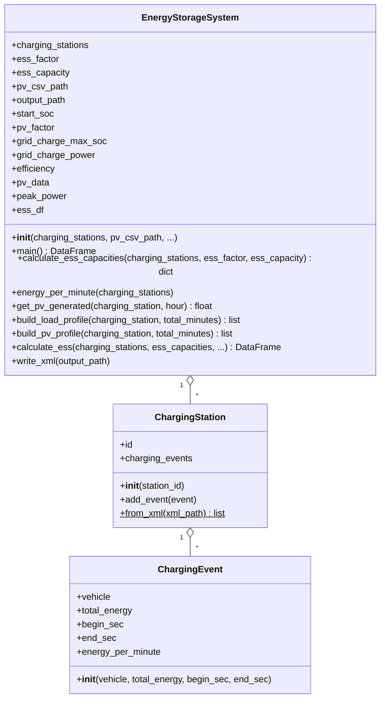

# Scenario/eBuS/energy_storage_system

The *energy_storage_system* package simulates a stationary battery (ESS) plus PV installation at every charging station. From the SUMO charging station output it derives a per-minute load profile, from the [PVGIS estimation](./pv_estimation_doc.md) a per-minute PV profile, and then simulates the battery minute by minute. The result is written as an XML file next to the seed's other outputs.
The package is called from [ebus_main](./ebus_main_doc.md#run-energy-storage-system) once for every seed of a run.

## Data Flow

## Units

| Quantity | Unit |
|---|---|
| Energy (charging events, PV, SoC, capacity, grid energy) | Wh |
| PV peak power | kW |
| `grid_charge_power`, `grid_power_kw` | kW |
| Time resolution of the simulation | 1 minute |

| Parameter | Description |
|---|---|
| `ess_factor` | Sizes each station's battery as `ess_factor * peak power`, in kWh per kWp of that station's PV. |
| `ess_capacity` | Static capacity (Wh) for every station. If set, it takes precedence over `ess_factor`. |
| `start_soc` | Start state of charge as a fraction (0.0 to 1.0) of each station's own capacity. |
| `pv_factor` | Scales the PV generation of every station (default 1.0). |
| `grid_charge_max_soc` | Enables forced grid charging: below this fraction of capacity the battery is charged from the grid. Optional. |
| `grid_charge_power` | Power (kW) drawn from the grid while forced charging is active. Must be set together with `grid_charge_max_soc`. |
| `efficiency` | Round-trip efficiency of the battery (0.0 to 1.0, default 1.0). |

## Charging Event
*charging_event.py*, plain data container for one charging event of a bus. It uses `__slots__` to keep the memory footprint low, as a run can contain many events.

| Attribute | Description |
|---|---|
| `vehicle` | Vehicle id |
| `total_energy` | Energy charged into the vehicle (Wh) |
| `begin_sec`, `end_sec` | Start and end of the charging in simulation seconds |
| `energy_per_minute` | Mean energy per minute (Wh), initialised with `0.0` and filled later by [energy per minute](#energy-per-minute) |

## Charging Station
*charging_station.py*, groups the charging events of one station.

### Add Event
Appends a [charging event](#charging-event) to the station.

### From XML
Class method. Parses the SUMO *chargingstations* output and reads every `chargingEvent` element (`vehicle`, `totalEnergyChargedIntoVehicle`, `chargingBegin`, `chargingEnd`). The events are assigned to a station by their `chargingStationId`. Stations are created on demand, so only stations with at least one charging event appear. The returned list is sorted by station id.

## Energy Storage System
*energy_storage_system.py*, holds the simulation. The module level constant `TOTAL_MINUTES = 1740` (29 hours) defines the simulated period and matches the 29 hourly values fetched by the PVGIS call. It has to be adapted if the simulated time span changes.

### Parse PV Data / Parse Peak Power
Module level helpers that read the scaled PV CSV.

- `parse_pv_data` returns `{station_id: [hourly PV values in Wh]}`. The `peak_power` column is dropped and the time columns are sorted numerically.
- `parse_peak_power` returns `{station_id: peak power in kW}`.

### Main
Runs the pipeline in this order:

1. Load PV data and peak power.
2. [Energy per minute](#energy-per-minute) for all charging events.
3. [Calculate ESS capacities](#calculate-ess-capacities).
4. [Calculate ESS](#calculate-ess), the battery simulation.
5. [Write XML](#write-xml), if an `output_path` was given.

Returns the result DataFrame.

### Calculate ESS Capacities
Returns `{station_id: capacity in Wh}`. The capacity is `peak_power * ess_factor * 1000`.

### Energy Per Minute
Edits the charging events in place: `total_energy / duration in minutes`.

### Get PV Generated
Returns the `pv_factor` scaled hourly PV energy of a station. The hour index wraps around (`hour % len(values)`), so it never runs out of range.

### Build Load Profile
Creates a list with one entry per minute containing the energy (Wh) charged into buses at the station. Each event is spread over the minutes it covers. Minutes that are only partially covered receive the matching share. Events are clipped to `0 ... total_minutes * 60` seconds.

### Build PV Profile
Creates a list with one entry per minute. The hourly PV energy is divided evenly over the 60 minutes of the hour.

### Calculate ESS
Simulates the battery of each station minute by minute and returns a DataFrame with one row per station and minute. The efficiency is split evenly: charging and discharging each apply `sqrt(efficiency)`, so a full cycle loses `1 - efficiency` overall.

For each minute, `net = pv - load`:

1. **Surplus** (`net >= 0`): the surplus, reduced by the charging efficiency, is stored up to the free capacity. What cannot be stored is curtailed (`pv_curtailed`).
2. **Deficit** (`net < 0`): the battery covers the deficit, taking `deficit / discharge efficiency` from the SoC. If the SoC is not sufficient, it is emptied and the remainder is drawn from the grid.
3. **Forced grid charging**: if `grid_charge_max_soc` is set and the SoC is still below that fraction of the capacity, energy is drawn from the grid at `grid_charge_power` (limited by the free capacity) on top of step 1 or 2. It passes through the same charging loss.

Output columns:

| Column | Description |
|---|---|
| `station_id`, `capacity`| Station and its sizing |
| `timestep_min` | Minute of the simulation |
| `pv_generated` | PV energy in that minute (Wh) |
| `energy_charged_bus` | Load from bus charging (Wh) |
| `energy_charged_storage` | Energy stored from the PV surplus, after charging loss (Wh) |
| `ess_soc` | State of charge at the end of the minute (Wh) |
| `grid_energy_drawn` | Grid energy in that minute, deficit plus forced charging (Wh) |
| `grid_power_kw` | The same as power (kW) |
| `pv_curtailed` | PV energy that could not be used or stored (Wh) |

### Write XML
Writes the DataFrame as SUMO-style XML, sorted by minute and station id. Each minute becomes a `<timestep time="...">` (in seconds) containing one `<station>` element per station with the attributes `id`, `capacity`, `pvGenerated`, `energyChargedBus`, `energyChargedStorage`, `essSoc`, `gridEnergyDrawn`, `gridPowerKw` and `pvCurtailed`.

## Note
The creation of this file was assisted by an llm.

Back to [Main Page](./documentation_best-ebus.md).  
Continue to [eBus Scenario Configuration](./ebus_scenario_config_doc.md)