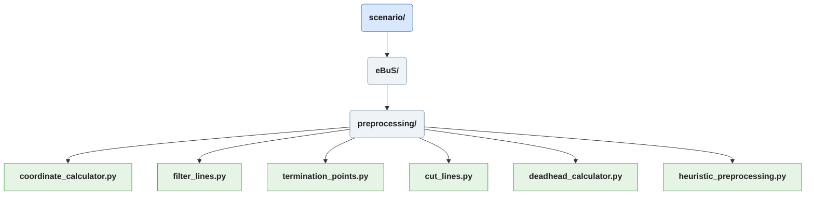
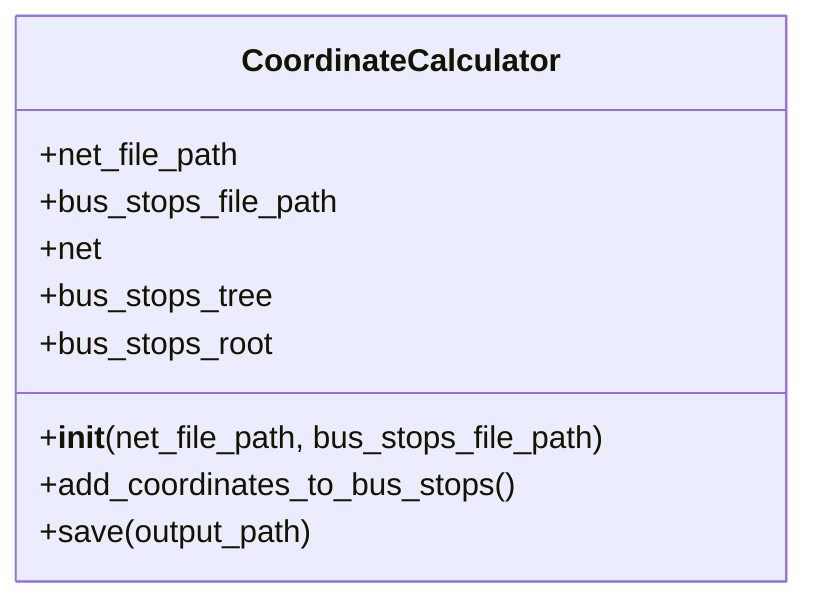
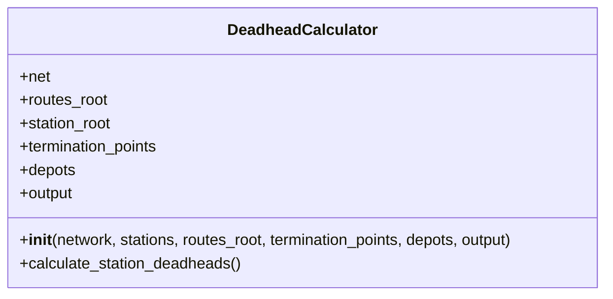
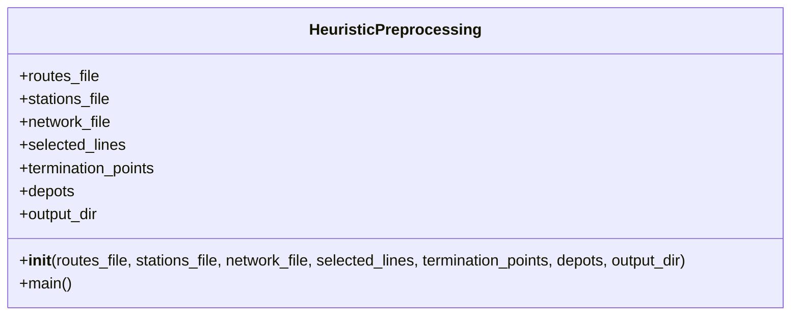

# Scenario/preprocessing
Skripts in *preprocessing* are used to create textfiles used as input for a solving heuristic. 
The six scrips are introduced in order of operations.

## Coordinate Calculator
This is a very simple skript, which only needs to be run whenever new bus stop is added to the scenario defintion.
The *coordinate_calculator* takes a .net.xml file and a .add.xml file containing **bus stops** and uses the function **positionAtShapeOffset** provided by sumolib to calculate the real world coordinates, which are then added to the stops under the **coordinate** attribute.

## Filter Lines
The *filter_lines* skript copys a .rou.xml file and removes every route and flow not found in the *[heuristic_preprocessing.lines]* table of *ebus_config.toml*. Additionaly an .add.xml file with the stops corresponding to the routes is read, to get humand readable names of departure and arrival station. This operation creates a *to* and *from* for each route, and calculates the number of requiered repetitions and period intevals from the corresponding flows. These parameters gathered from the .xml files are then combined into a *trips.txt* file routes and flows of each line. 

It performs the definition of depots and belonging service lines. For that it assumes a *[heuristic_preprocessing.lines]* table in *ebus_config.toml*, mapping each line to its depot and vehicle type. \
Available lines are taken from *berlin_bus.rou.xml*, where there is a *to* and *from* for each.
For eBuS this data has been taken from the website [berliner-lininchronik.de](https://www.berliner-linienchronik.de/fahrzeuge-bvg.html) (Sawall, Fabian; 2026) \
While manual definition of routes is possible, and adjustments can be made to fine-tune simulation behaviour, the assignment of vehciles to services is computed by a heuristic solving method (Janus, Robert; n.y.)

While **BeST** operates on the **SUMO** flow-functionality, which generates and destroys vehicles for a given route periodically, **eBuS** requieres the use of persistent vehicles.

