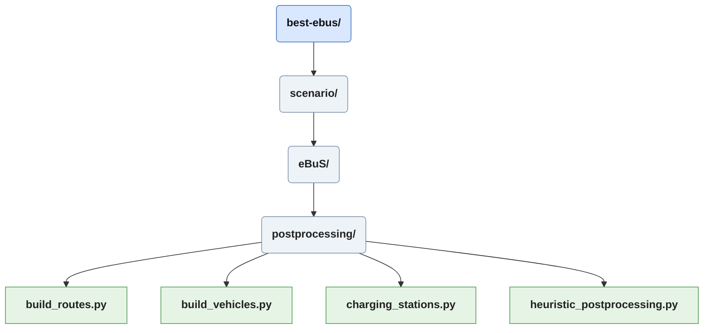
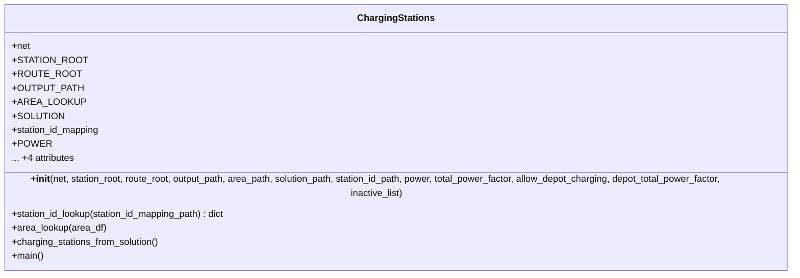
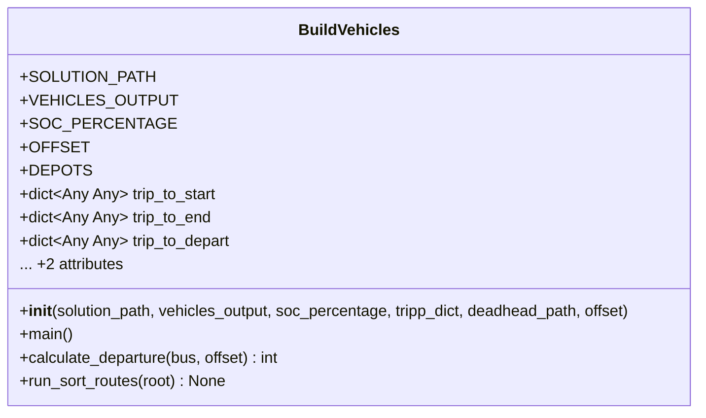
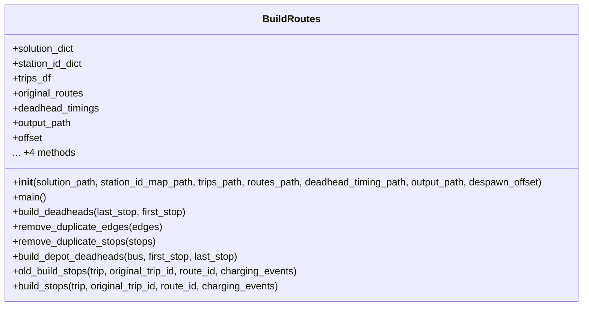
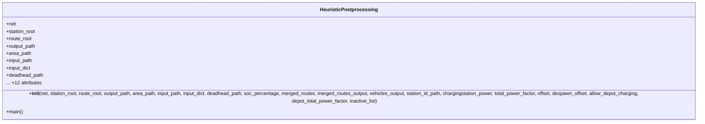

# Scenario/postprocessing

Scripts in *postprocessing* take a solution in a specific format to then build fully realised vehicles and their routes from the previously defined trips.

# Charging Stations

The *charging_stations.py* reads designated charging station IDs from the solution, corresponding bus stops are read from *berlin_bus_stops.add.xml* and modified into charging stations at the same position. Chargers at the depots are added. Here modifications to charging station parameters can be made. For future functionality geo coordinates are calculated and saved.

## Build Vehicles
The *build_vehicles.py* script is the first step of creating the desired buses in the form utilized by sumo. The number, type and depot affiliation is determined by the solution file. A vehicle is build according to the definition from SUMO. Ids in the format "bus_{id from solution}" need to be unique. The type, needs to either be a SUMO default, or taken from additionally defined vehicles types. In this case it determines the exact type of vehicle used, data on line-type association is taken from [berliner-lininchronik.de](https://www.berliner-linienchronik.de/fahrzeuge-bvg.html) (Sawall, Fabian; 2026).

## Build Routes

The creation of routes in *build_routes.py* is a centerpiece of the scenario preparation. The script reads the solution, and stitches the route from the individual trips, adjusting stops, cutting duplicate edges and stops while adding charging events and depot departure and arrival.

## Heuristic Postprocessing
*heuristic_preprocessing.py* is a wrapper for all other scripts in the *preprocessing* directory, performing the functions calls in order.

Next Chapter [Scenario/ebus_main](./ebus_main_doc.md).
