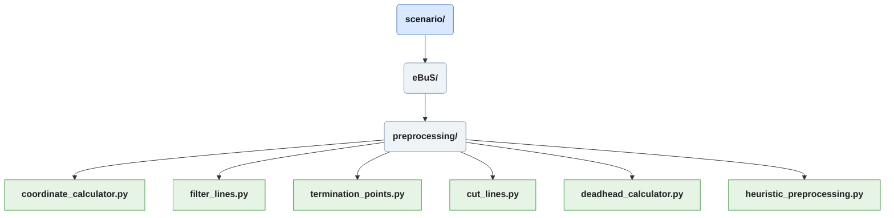
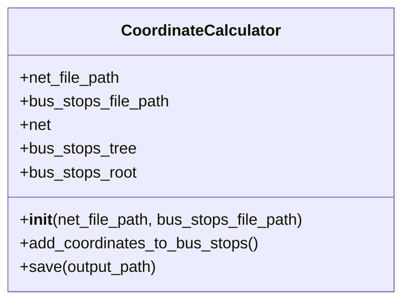
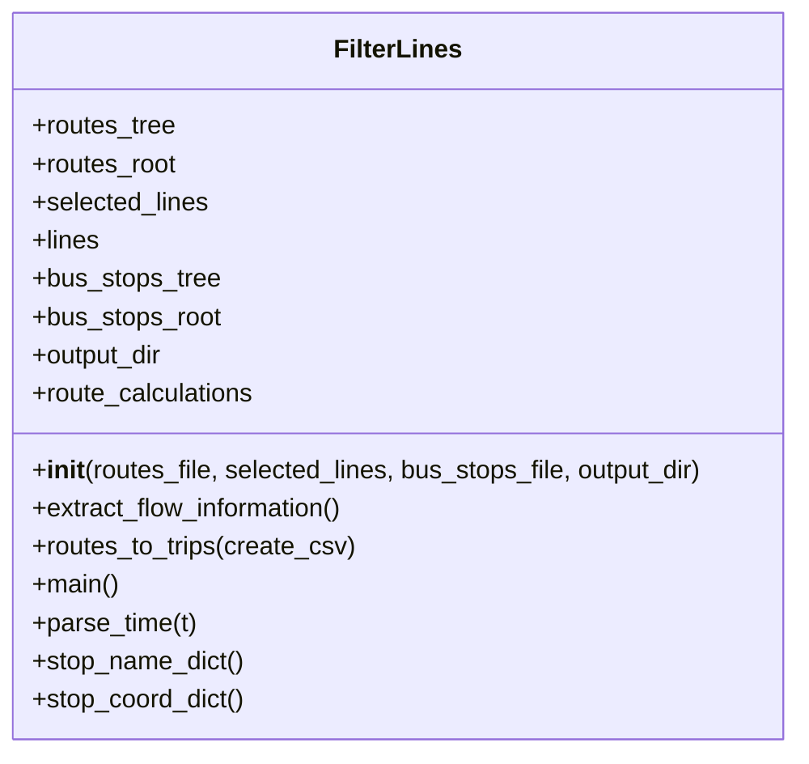
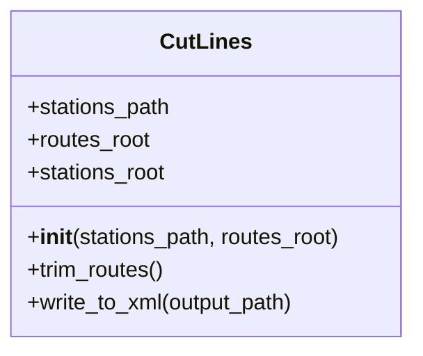
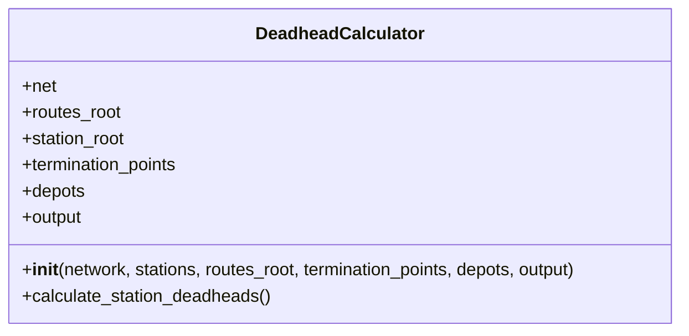
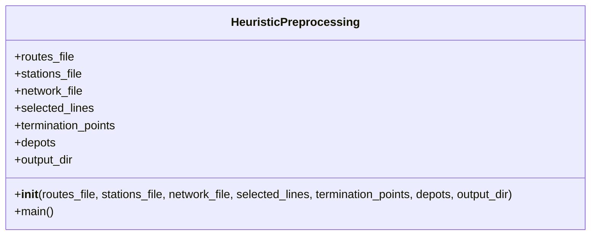

# Scenario/preprocessing
Scripts in *preprocessing* are used to create text files used as input for a solving heuristic. 
The six scripts are introduced in order of operations.

## Coordinate Calculator
This is a very simple script, which only needs to be run whenever a new bus stop is added to the scenario definition.
The *coordinate_calculator* takes a .net.xml file and a .add.xml file containing **bus stops** and uses the function **positionAtShapeOffset** provided by sumolib to calculate the real-world coordinates, which are then added to the stops under the **coordinate** attribute.

## Filter Lines
The *filter_lines* script creates a copy of the .rou.xml file and removes every route and flow not found in the *[heuristic_preprocessing.lines]* table of *ebus_config.toml*. Additionally, an .add.xml file with the stops corresponding to the routes is read to get human-readable names of departure and arrival stations. This operation creates a *to* and *from* for each route and calculates the number of required repetitions and period intervals from the corresponding flows. These parameters gathered from the .xml files are then combined into a *trips.txt* file from routes and flows of each line. 

## Cut Lines

The *cut_lines* script again is very simple and does as its name suggests. It cuts all edges before the first occurrence of the departure station and after the last occurrence of the arrival station. This is necessary as buses may perform undesired circling back operations, drive to unmarked waiting spots, or perform a simulation exiting route in the original GTFS data used by BeSt.

## Deadhead Calculator
The *deadhead_calculator* picks up where the routes were left after cutting and filtering, calculating the timings between all possible termination points based upon the used network itself, and appends these to the route file. They are named using the following format: "route{FromStopId}_{ToStopId}".

## Heuristic Preprocessing
*heuristic_preprocessing.py* is a wrapper for all other scripts in the *preprocessing* directory, performing the functions calls in order.

Next Chapter [Scenario/postprocessing](./postprocessing_doc.md).
