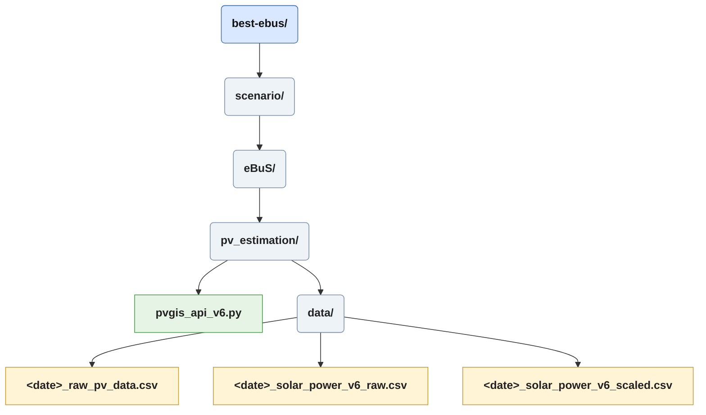
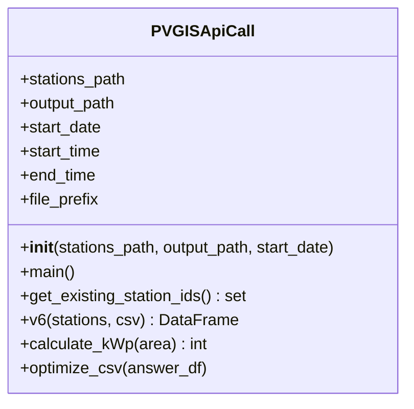

# Scenario/eBuS/pv_estimation/pvgis_api_v6

The *pvgis_api_v6.py* module estimates the photovoltaic (PV) yield for every charging station. For each station it queries the [PVGIS v6 API](https://joint-research-centre.ec.europa.eu/pvgis-photovoltaic-geographical-information-system_en) with the station's coordinates and estimated installed capacity, scales the returned hourly power values, and stores the result as CSV files.
The scaled CSV is the input for the [Energy Storage System](./ess_doc.md). The module is called from [ebus_main](./ebus_main_doc.md#run-pvgis-api-call).

## Inputs and Outputs

| | Description |
|---|---|
| **Input** | *e_stations.add.xml* (`sumo/electric/`), read for every `chargingStation` element and its `id`, `coordinates` (`lon,lat`) and `area` attributes |
| **Input** | `start_date` (a `date`, a `datetime`, or an ISO string such as `"2024-06-22"`) |
| **Output** | `<start_date>_raw_pv_data.csv`: one row per station, with the complete raw and scaled API responses |
| **Output** | `<start_date>_solar_power_v6_raw.csv`: hourly PVGIS values per station |
| **Output** | `<start_date>_solar_power_v6_scaled.csv`: hourly values scaled by the station's installed capacity (used by the ESS) |

All files are written to `eBuS/pv_estimation/data/` and are prefixed with the start date, so different dates never overwrite each other.

## Constructor
Stores the paths and derives the time window from `start_date`:

- `start_time`: `<start_date> 00:00:00`
- `end_time`: `<start_date + 1 day> 04:59:59`
- `file_prefix`: `<start_date>_`

The window reaches into the following morning so that late-running simulated operation past midnight is still covered. This results in 29 hourly values per station.

## Main
Runs [v6](#v6) and, if new stations were processed, passes the result to [optimize csv](#optimize-csv). If no new stations were found the function returns without writing anything.

## Get Existing Station IDs
Reads the `station_id` column of `<start_date>_raw_pv_data.csv` (if it exists) and returns the ids as a set. This makes the API calls incremental: only stations that are not yet in the file are requested. Consequently a high number of calls happens on the first run for a date, or after new charging stations were created. The server may rate limit requests.

## v6
Core function. For every `chargingStation` in the stations file that is not yet in the raw data file:

1. Calculates the installed capacity with [calculate kWp](#calculate-kwp) from the station's `area`.
2. Splits `coordinates` (`lon,lat`) into latitude and longitude.
3. Sends a `GET` request (timeout 60 s) to the PVGIS `api/v6/power/broadband` endpoint with these parameters:

| Parameter | Value |
|---|---|
| `latitude`, `longitude` | station coordinates |
| `installation_height` | `5` (assumption: modules are mounted above pantograph height, i.e. above the bus roof) |
| `start_time`, `end_time` | see [Constructor](#constructor) |
| `surface_position_optimisation_mode` | `Orientation & Tilt` (fixed orientation/tilt are commented out) |
| `frequency` | `Hourly` |
| `timezone` | `Europe/Berlin` |
| `peak_power` | installed capacity in kWp |

4. Checks the response with `raise_for_status()` and keeps the raw JSON.
5. Builds a scaled copy, in which every `power` value is multiplied by the station's `peak_power`. This is a workaround, as PVGIS returns the production normalized per installed kWp.

The collected results (`station_id`, `peak_power`, `raw_solar_data`, `scaled_solar_data`) are appended to `<start_date>_raw_pv_data.csv` and returned as a DataFrame.

## Calculate kWp
Estimates the installed capacity of a station from its available area:

- Panel: 500 W on 2.4 m²
- `panels = floor(area / 2.4)`
- `kWp = floor(panels * 500 / 1000)`

The result is a whole number of kWp. The area is truncated to an integer first.

## Optimize CSV
Converts the API responses into a flat, SUMO-time based format. The 29 hourly values are stored in the columns `3600, 7200, ... 104400` (seconds since the start date's midnight), next to `station_id` and `peak_power`. One file is written for the raw and one for the scaled values. Both are opened in append mode and get a header only when created.

Next Chapter [Energy Storage System](./ess_doc.md).